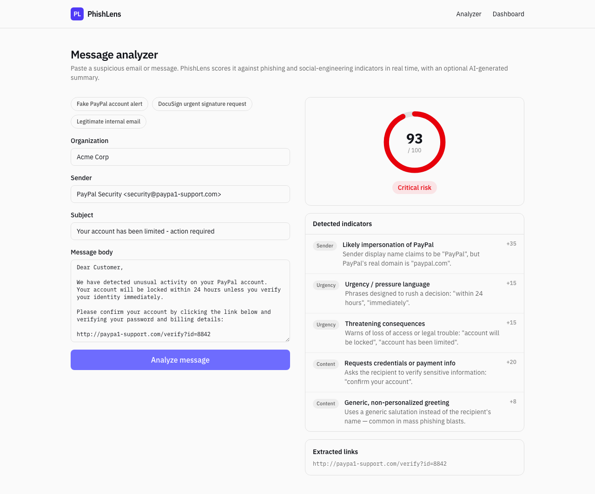
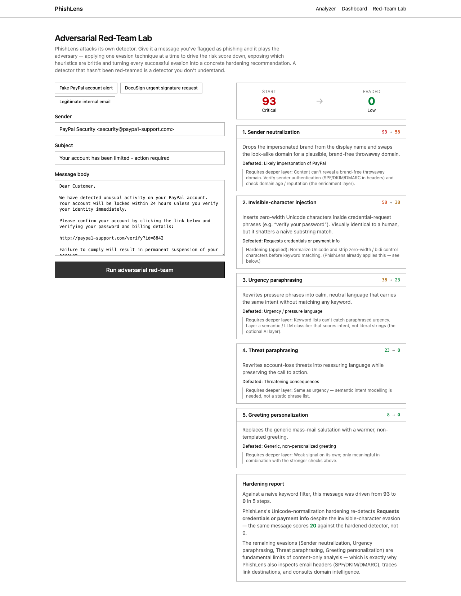
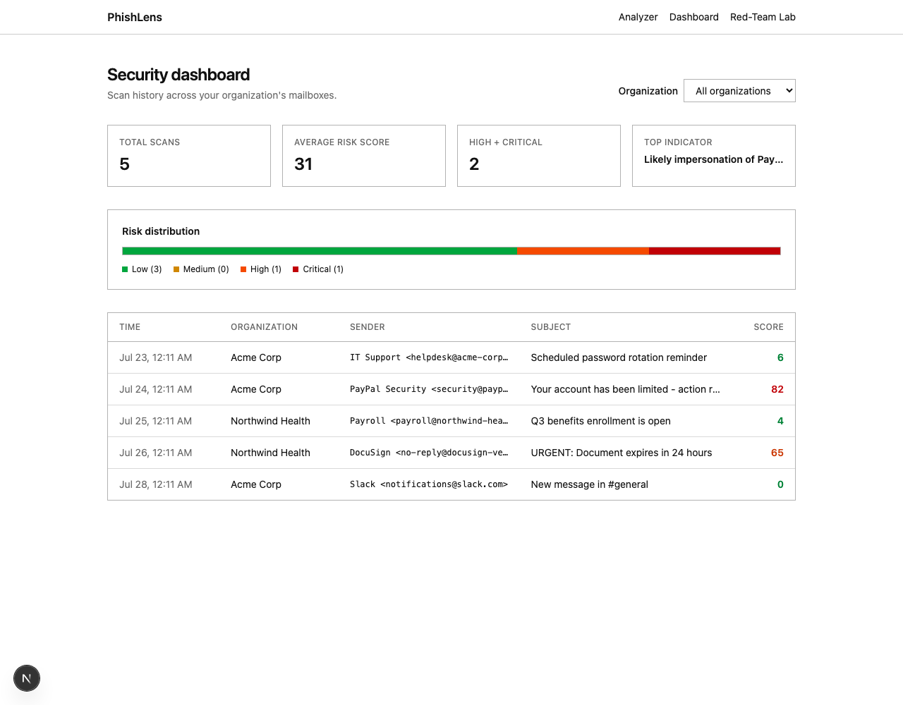

# PhishLens

**Real-time phishing & social-engineering detection for email and messages.**

Built for the Cybersecurity track. PhishLens takes a raw email or message (sender,
subject, body) and returns an explainable risk score in real time — no ML training
data or third-party threat-intel subscription required — plus an optional
AI-generated plain-English summary, an optional Python domain-intelligence layer,
and a multi-tenant dashboard so a security team can see trends across an
organization.



## Why this exists

Phishing remains the single most common entry point for breaches, and most existing
tools are either heavyweight enterprise email-security suites (expensive, opaque) or
naive keyword blockers (easy to evade, no explanation of *why* something was flagged).
PhishLens focuses on **explainability**: every score is broken down into the specific
indicators that triggered it, so a non-technical employee — or a judge three minutes
into a demo — can see exactly why a message is dangerous.

## How it works

1. **Heuristic engine** (`src/lib/phishing-engine.ts`, unit-tested in
   `phishing-engine.test.ts`) — a rules engine that scores a message against real
   phishing tradecraft:
   - Brand impersonation across ~48 commonly-spoofed brands: display name claims a
     brand but the domain doesn't match, the domain is a close typo, *or* the brand
     name is simply stuffed into an unrelated domain with no display-name claim at all
   - Homograph / lookalike-domain detection: punycode-encoded (IDN) domains, and
     domains where a single label mixes Latin with Cyrillic/Greek look-alike
     characters. The per-label check matters — testing the whole hostname at once
     flags any non-Latin domain on a `.com` TLD, since `com` is itself Latin. This
     runs independently of the brand list, so it also catches impersonation of brands
     PhishLens doesn't know about. A label written *entirely* in one non-Latin script
     is invisible to this check by construction; that case needs the full Unicode
     confusables table and is handled by the Python layer below.
   - Suspicious links: raw IP-address URLs, URL shorteners, abused top-level domains,
     and link text that doesn't match its actual destination
   - Urgency and threat language, credential/payment-harvesting phrasing, generic
     non-personalized greetings, Reply-To/sender domain mismatches, suspicious
     executable attachments

   Every trigger is a scored, human-readable indicator, not a black-box number.

2. **Adversarial Red-Team Lab** (`/lab`, `src/lib/adversary.ts`, unit-tested in
   `adversary.test.ts`) — the headline feature: PhishLens attacks *its own detector*.
   Give it a message flagged as phishing and it plays the adversary, applying one
   evasion technique at a time (invisible-character injection, urgency/threat
   paraphrasing, sender neutralization, link laundering) and keeping whichever lowers
   the risk score most — a live step-by-step "descent" from Critical to Low. Every
   successful evasion is turned into a concrete hardening recommendation, and the
   fully-evaded message is re-scored against the *hardened* detector to prove which
   attacks PhishLens already defeats (invisible-character injection is neutralized by
   the Unicode-normalization hardening this feature motivated) versus which are
   fundamental limits of content-only analysis — the exact justification for the
   header-forensics, link-tracing, and domain-intelligence layers below. It's a
   defensive tool: it red-teams our classifier and outputs defenses, it does not
   manufacture novel phishing.

   

3. **Raw email (.eml) header forensics** (`src/lib/eml.ts`, `src/lib/header-analysis.ts`,
   unit-tested in `header-analysis.test.ts`) — drag a real `.eml` file onto the
   analyzer and PhishLens parses the full message and reads the forensic evidence that
   plain pasted text can't carry:
   - The receiving mail server's own `Authentication-Results` — the SPF, DKIM, and
     DMARC verdicts it computed at delivery time. A failing DKIM signature or SPF check
     is hard evidence of forgery, and we read the server's conclusion rather than
     re-doing DNS work.
   - `Return-Path` vs `From` and `Reply-To` vs `From` domain mismatches — staples of
     spoofing and invoice/executive-impersonation fraud.
   - The `Received:` delivery-hop chain, surfaced in the report.

4. **Safe link redirect tracer** (`src/lib/trace.ts`, `/api/trace`) — for any link
   found in a message, trace where it *actually* goes, hop by hop
   (`bit.ly/x → tracker → paypa1-support.com/login`), server-side, without the user's
   browser ever touching the destination. Because "fetch an attacker-chosen URL on the
   server" is an SSRF risk by construction, every hop's hostname is resolved and
   blocked if it points at a private, loopback, or cloud-metadata address, with a cap
   on redirect count.

5. **Incident report + alerting** (`/report/[id]`, `src/lib/alert.ts`) — every scan
   gets a clean, printable/PDF-able incident report (verdict, indicators, header
   forensics, delivery path, links). If `ALERT_WEBHOOK_URL` is set, High/Critical scans
   fire a Slack-compatible webhook (also works with Discord/Mattermost) — fire-and-forget,
   never blocking the scan.

6. **Optional AI layer** (`src/lib/ai-explain.ts`) — if `ANTHROPIC_API_KEY` is set,
   the app asks Claude to turn the indicator list into a 3–5 sentence plain-English
   explanation and recommended action for a non-technical recipient. Bounded by an
   8s timeout; if it's slow, errors, or the key isn't set, the app falls back to
   heuristic-only results and says so in the UI rather than silently doing nothing.

7. **Optional Python enrichment layer** (`python-service/`) — a FastAPI service
   providing a second signal source for things that need a live network call, which
   is exactly what a pasted message with no headers is missing: WHOIS domain age,
   SPF and DMARC record lookups, and full-table Unicode confusables detection. All
   checks run concurrently, each with its own timeout, under a 3.2s budget — the Node
   caller gives up at 4s and a single WHOIS query can take three of them. Every check
   fails closed to `null` ("couldn't determine"), never an exception.

   The confusables check is stronger than the Node-side one in a specific way worth
   knowing: standard mixed-script detection misses domains written *entirely* in a
   non-Latin script, so `xn--80ak6aa92e.com` — which renders as `аррӏе.com`, the
   best-known homograph attack there is — passes it. This layer maps each character
   to its ASCII look-alike and flags the label only when all of them map, catching
   whole-script imitation while leaving genuine non-Latin domains (`пример.рф`,
   `中国.cn`) alone.

   DKIM is checked but deliberately **not scored** — probing common selectors can't
   see a key published under a custom one, and an early version docked points from
   `google.com` because of it. It's returned as context instead. Same
   optional-dependency pattern as the AI layer: unset `PYTHON_SERVICE_URL` or a
   down/slow service degrades gracefully, never a hard failure. See
   `python-service/README.md`.

8. **Multi-tenant scan history** (`src/lib/store.ts`) — every scan is tagged with an
   organization and stored, powering the `/dashboard` view: total scans, average risk
   score, risk distribution, and a searchable history table.



## Installation

Requires **Node.js ≥20.9** (Next.js 16's minimum).

```bash
npm install
npm run dev
```

Open [http://localhost:3000](http://localhost:3000). That's it — the heuristic engine
needs no API keys or external services.

Run the test suite:

```bash
npm test
```

To enable the optional AI explanation layer, copy `.env.example` to `.env.local` and
add an Anthropic API key:

```bash
cp .env.example .env.local
# then edit .env.local and set ANTHROPIC_API_KEY
```

To enable the optional Python enrichment layer, see `python-service/README.md`, then
set `PYTHON_SERVICE_URL` (e.g. `http://localhost:8000`) in `.env.local`.

To enable High/Critical webhook alerts, set `ALERT_WEBHOOK_URL` in `.env.local` to a
Slack (or Discord/Mattermost) incoming-webhook URL.

## Demo script

1. **Open the money shot first: go to `/lab`** and click **Run adversarial red-team**.
   Watch PhishLens attack its own detector and drive a Critical (93) phishing email down
   to Low (0) step by step, then read the hardening report showing which evasion it
   already defeats and why the rest of the product's layers exist. This is the "sit up"
   moment.
2. Go to `/` and click a sample button to load a realistic message, or paste your own —
   click **Analyze message** and watch the score, indicator list, and (if a key is set)
   the AI summary populate.
3. **Drag `docs/samples/phishing-sample.eml` onto the dropzone** and analyze it — this
   adds the header-forensics panel (failing SPF/DKIM/DMARC, Return-Path and Reply-To
   mismatches) on top of the content indicators, pushing it to a 100/Critical verdict.
4. In the **Extracted links** panel, click **Trace destination** on the link to follow
   its redirect chain server-side to the real endpoint.
5. Click **View full incident report** for the printable/PDF-able summary.
6. Go to `/dashboard` for the org-wide scan history and risk distribution.
7. (Optional) With `ALERT_WEBHOOK_URL` set to a Slack channel, analyze the .eml sample
   live and watch the red alert land in Slack mid-demo.

## Project structure

```
src/
  app/
    page.tsx                 analyzer UI (home)
    dashboard/page.tsx        org-scoped scan history + stats
    report/[id]/page.tsx      printable incident report for a scan
    api/analyze/route.ts      POST: scores a message/.eml, stores it, returns result
    api/history/route.ts      GET: scan history + known orgs
    api/trace/route.ts        POST: safely trace a link's redirect chain
  components/
    AnalyzerForm.tsx           form, .eml dropzone, results, link tracer (client)
    RiskGauge.tsx               score + level display
    Nav.tsx / PrintButton.tsx   shared nav bar / print control
  lib/
    phishing-engine.ts          content scoring engine (pure functions, unit-tested)
    header-analysis.ts          .eml header forensics (unit-tested)
    eml.ts                       raw .eml parsing (postal-mime)
    trace.ts                     link redirect tracer with SSRF guards
    alert.ts                     High/Critical webhook alerts
    ai-explain.ts                optional Claude API call, with timeout + status
    enrich.ts                    optional Python service call, with timeout + status
    rate-limit.ts                 in-memory per-IP rate limiter for the API routes
    store.ts                      in-memory scan history, best-effort disk persistence
    samples.ts                    canned demo messages
docs/samples/phishing-sample.eml  demo email with failing auth + spoofed headers
python-service/
  app.py                         FastAPI enrichment: WHOIS age, SPF/DMARC, confusables
  requirements.txt
```

## Known limitations

Being upfront about these rather than papering over them:

- **Keyword heuristics can false-positive on legitimate marketing email.** A real
  "Sale ends today!" newsletter can trip the urgency-language indicator. Weights are
  tuned so a single such indicator alone stays in the Low band, but an aggressive
  marketing email combined with a generic greeting could tip into Medium.
- **Link-text-mismatch detection only works on markdown/HTML-style links**
  (`[text](url)` or `<a href>`), not plain "click here: http://evil.com" text. Pasting
  plain text has no way to represent a styled hyperlink; uploading the original `.eml`
  preserves the real HTML anchors, so this is much stronger on uploaded emails.
- **Header forensics requires the raw `.eml`.** A copy-pasted message body has no
  headers, so SPF/DKIM/DMARC and Return-Path analysis only run on uploaded files. This
  is inherent — the evidence simply isn't present in pasted text.
- **The brand-impersonation list is finite** (~48 well-known brands). Impersonation of
  anything outside it relies on the homograph/typo checks catching it, or on the
  Python enrichment layer's domain-intelligence signals (domain age, SPF/DMARC,
  confusables), which are brand-agnostic.
- **The Python layer's DKIM check is informational, not scored**, because selector
  probing produces false negatives on domains using custom selectors. A real
  deployment would read the DKIM result from the receiving server's
  `Authentication-Results` header instead — which PhishLens already does for uploaded
  `.eml` files.
- **WHOIS coverage is uneven across TLDs.** Some registries rate-limit or withhold
  creation dates, in which case domain age returns "couldn't determine" rather than a
  wrong answer — so the absence of an age indicator is not evidence a domain is old.
- **The in-memory store is single-process.** It survives concurrent requests within
  one running server (no read-modify-write race), and persists to disk best-effort
  for local dev convenience, but on a multi-instance serverless deploy each instance
  would have its own history. Fine for a hackathon demo; a real deployment would swap
  this for a shared database.
- **The in-memory rate limiter is per-instance**, not distributed. It stops casual
  single-source abuse of a public demo URL; it isn't a substitute for a real
  rate limiter (e.g. Upstash/Redis) in production.

## Roadmap

- Real inbox integration (Gmail/Outlook add-in) instead of copy-paste / file upload
- Persistent shared database + auth instead of a local JSON store
- A trained phishing classifier in the Python layer (`ml_phishing_probability` is
  already in the response contract, currently always `null`)
- Attachment content scanning, not just filename heuristics

## Team

[Ivan S.](https://linkedin.com/in/ivan-stashchak)
